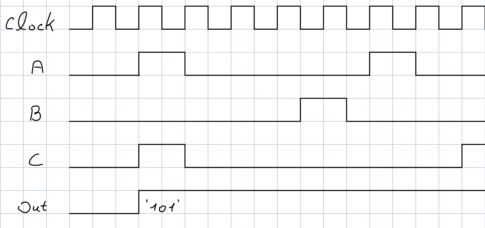

# First Signal Detector

A SystemVerilog implementation of a first-arrival signal detector that captures and locks onto the first signal(s) detected among three inputs.

## Waveform Example

The following waveform demonstrates the detector's behavior when A and C arrive simultaneously:



**Key Points:**
- Clock cycles 1-2: A and C are both active → Output = '101' (A=1, B=0, C=1)
- Clock cycles 3+: Various input changes occur, but output remains locked at '101'
- This demonstrates the "first-come-first-served" lock mechanism

The detector captures the **first** pattern it sees and ignores all subsequent input changes until reset.

## Features

- **First-Come-First-Served Detection**: Captures the first signal(s) to arrive
- **Simultaneous Signal Support**: Can detect multiple signals arriving at the same time
- **Lock Mechanism**: Once detected, the output is locked and ignores future signal changes
- **Synchronous Reset**: Clean reset functionality with proper timing

## Design Specifications

### Inputs
- `clk`: System clock
- `rst`: Active-low reset 
- `a`, `b`, `c`: Three input signals to monitor

### Outputs
- `y[2:0]`: 3-bit output encoding detected signals
  - `y[0]`: High if signal A was detected
  - `y[1]`: High if signal B was detected  
  - `y[2]`: High if signal C was detected

### Truth Table
| A | B | C | Output | Meaning |
|---|---|---|--------|---------|
| 0 | 0 | 0 | 000    | No signals detected |
| 1 | 0 | 0 | 001    | A detected first |
| 0 | 1 | 0 | 010    | B detected first |
| 0 | 0 | 1 | 100    | C detected first |
| 1 | 1 | 0 | 011    | A and B detected simultaneously |
| 1 | 0 | 1 | 101    | A and C detected simultaneously |
| 0 | 1 | 1 | 110    | B and C detected simultaneously |
| 1 | 1 | 1 | 111    | All signals detected simultaneously |

## File Organization
```
first-signal-detector/
├── README.md                    # Project overview and documentation
├── LICENSE                      # MIT License
├── .gitignore                   # Git ignore rules
├── .gitattributes              # Git attributes for line endings
├── rtl/
│   └── detector.sv              # Main design module
├── tb/
│   ├── detector_tb.sv           # Comprehensive testbench
│   └── detector_if.sv           # SystemVerilog interface definition
└── docs/
    ├── design_spec.md           # Detailed design specification
    └── waveform_example.jpg     # Timing diagram example
```

## Usage

### Vivado Simulation
1. Open Vivado
2. Add all source files from `rtl/` and `tb/` directories
3. Set `detector_tb` as the top module for simulation
4. Run simulation: `run 1000ns`

### Manual Compilation
```bash
# Compile design and testbench
vlog rtl/detector.sv tb/detector_if.sv tb/detector_tb.sv

# Run simulation
vsim -gui detector_tb

# Add waves and run
add wave -r /*
run 1000ns
```

## Test Coverage

The testbench includes comprehensive verification:

1. **Reset Functionality**: Verifies proper reset behavior
2. **Single Signal Detection**: Tests individual signal detection (A, B, C)
3. **Simultaneous Detection**: Tests all combinations of simultaneous signals (AB, AC, BC, ABC)
4. **Lock Behavior**: Verifies first-detection locks and ignores subsequent changes

## Implementation Details

- Uses sticky enable mechanism with D flip-flop for state memory
- Combinational logic determines which signals to capture
- Once any signal is detected, the enable becomes permanently high
- Output is updated only during the first detection cycle

## Author

**Asaf Kamber**

## License

MIT License - see [LICENSE](LICENSE) file for details.